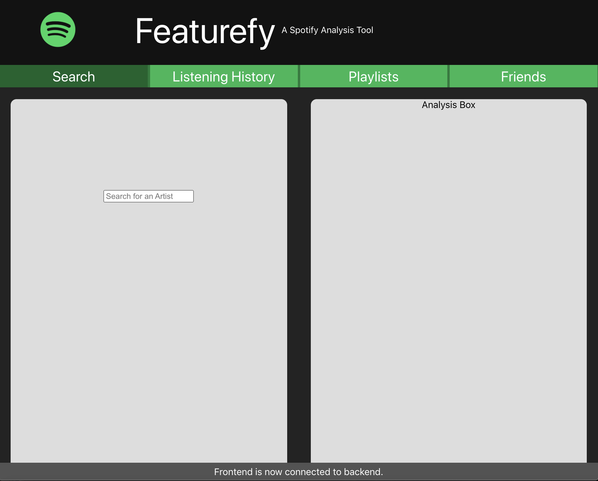
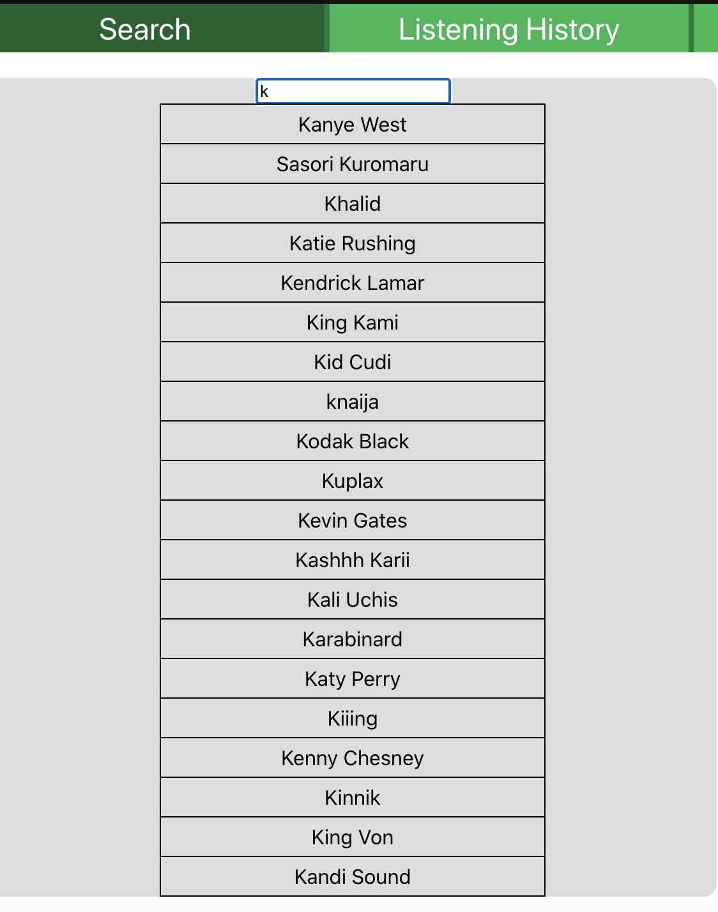
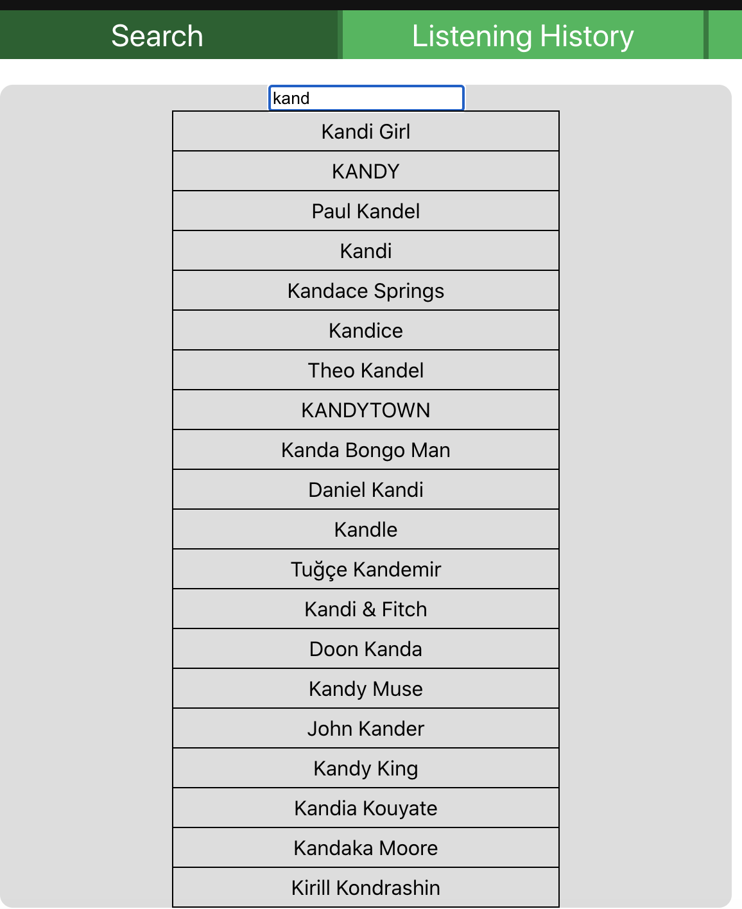

# FeatureFy, a spotify music analysis tool

This application will allow the user to select large collections of music, such as artist discographies or personal playlists, and analyze their track features at a broad scale view. 

The idea behind this app is to visually show listeners new insights about their favorite music, and use these insights to find similar music. 

## Current features:
* switch between different panel views by navigating bar near top of screen
* real time autocompletion of artists you search (top 5 results)

